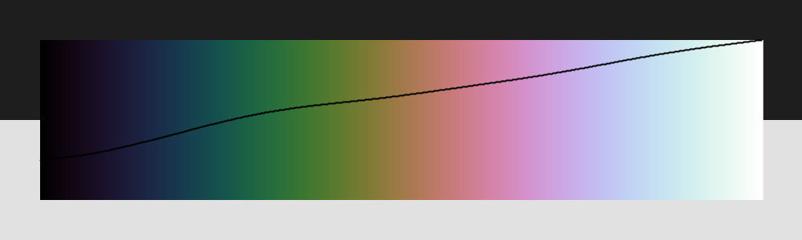
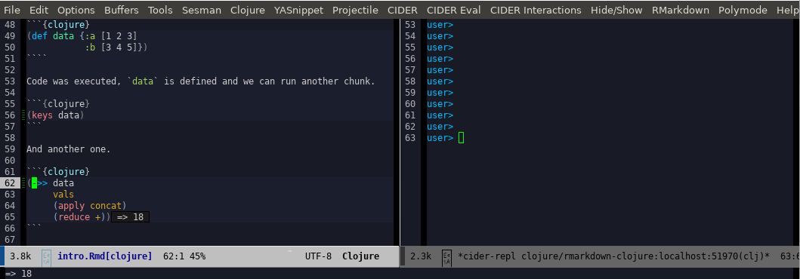

---
output:
    html_document:
        highlight: pygments
        theme: sandstone
    pdf_document:
        highlight: tango
    md_document:
        variant: markdown_github
    word_document:
        highlight: tango
---

```{r setup, include=FALSE}
nrepl_port <- "64780"
library(knitr)
knitr_one_string <- knitr:::one_string
nrepl_cmd  <- "rep"
opts_chunk$set(comment=NA, highlight=TRUE)
knit_engines$set(clojure = function(options) {
    code <- paste("-p", nrepl_port, shQuote(knitr_one_string(options$code)))
    out <- if (options$eval) {
               if (options$message) message('running: ', nrepl_cmd, ' ', code)
               tryCatch(
                   system2(nrepl_cmd, code, stdout = TRUE, stderr = TRUE, env = options$engine.env),
                   error = function(e) {
                       if (!options$error) stop(e)
                       paste('Error in running command', nrepl_cmd)
                   }
               )
           } else ''
    if (!options$error && !is.null(attr(out, 'status'))) stop(knitr_one_string(out))
    engine_output(options, options$code, out)})
```

# Generating documents with `knitr` and Clojure

This html document is rendered by R `knitr` package with embedded Clojure code. Yes, it's possible. 
The renderer is configured to use `nRepl` client: [`rep`](https://github.com/eraserhd/rep).

## What is knitr in short

Knitr is R package which generates really variety documents out of markdown file with embedded code. 

## First run

First let's define `data`.

```{clojure}
(def data {:a [1 2 3]
           :b [3 4 5]})
````

Code was executed, `data` is defined and we can run another chunk.

```{clojure}
(keys data)
```

And another one.

```{clojure}
(->> data
     vals
     (apply concat)
     (reduce +))
```

## Generate image

```{clojure}
(require '[clojure2d.core :refer [save]]
         '[clojure2d.color :as c]
         '[clojure2d.extra.utils :as u])
```

```{clojure}
(def img (-> :cubehelix
             (c/gradient)
             (u/gradient->image true)
             (save "gradient.png")))
```


## How to setup

I'm using Emacs with CIDER here. 

* Clojure
    * Download and install [`rep`](https://github.com/eraserhd/rep)
    * Be able to run `nRepl`
* R
    * Install R with `knitr` package (and all needed deps, like `pandoc`)
* Emacs
    * Install `ESS`, `poly-R` package which enables REPL inside Markdown file.

Run `nRepl`, create `.Rmd` file and add below chunk at the beginning of it. As you can see, there is a place to define `nrepl_port`. Find your port and change this value. I haven't been able to find an easy way to setup it automatically (yet).

````markdown
`r ''````{r setup, include=FALSE}
nrepl_port <- "53247"
library(knitr)
knitr_one_string <- knitr:::one_string
nrepl_cmd  <- "rep"
opts_chunk$set(comment=NA, highlight=TRUE)
knit_engines$set(clojure = function(options) {
    code <- paste("-p", nrepl_port, shQuote(knitr_one_string(options$code)))
    out <- if (options$eval) {
               if (options$message) message('running: ', nrepl_cmd, ' ', code)
               tryCatch(
                   system2(nrepl_cmd, code, stdout = TRUE, stderr = TRUE, env = options$engine.env),
                   error = function(e) {
                       if (!options$error) stop(e)
                       paste('Error in running command', nrepl_cmd)
                   }
               )
           } else ''
    if (!options$error && !is.null(attr(out, 'status'))) stop(knitr_one_string(out))
    engine_output(options, options$code, out)})
```
````

When it's done you can generate documents (html, pdf, whatever) within `ESS` or from external R session.

```{r eval=FALSE}
render("README.Rmd","all")
```

## Emacs view



## Rendered documents

* [HTML](https://genmeblog.github.io/rmarkdown-clojure/README.html)
* [PDF](https://github.com/genmeblog/rmarkdown-clojure/blob/master/README.pdf)
* [WORD](https://github.com/genmeblog/rmarkdown-clojure/blob/master/README.docx)

## What's odd

There are couple of problems:

* manual renderer setup
* manual port setup
* no pretty printing results by default

## RMarkdown reference

https://bookdown.org/yihui/rmarkdown/

