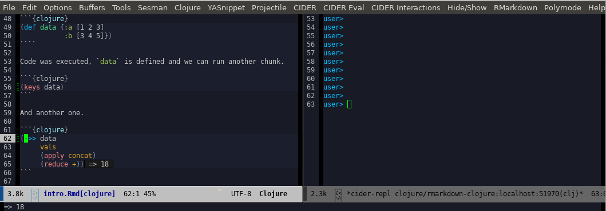

Using Clojure snippets in knitr
===============================

This html document is rendered by R `knitr` package with embedded Clojure code. Yes, it's possible. It's even possible by default but the default version is not usable. The default version is using `lein exec` and is very, very slow. And doesn't keep session.

This version is configured to use `nRepl` client, [`rep`](https://github.com/eraserhd/rep) which works pretty well. Add to this Emacs and you get REPL in the Markdown file.

What is knitr in short
----------------------

Knitr is R package which generates really nice documents out of markdown file with embed code.

First run
---------

First let's define `data`.

``` clojure
(def data {:a [1 2 3]
           :b [3 4 5]})
```

    #'user/data

Code was executed, `data` is defined and we can run another chunk.

``` clojure
(keys data)
```

    (:a :b)

And another one.

``` clojure
(->> data
     vals
     (apply concat)
     (reduce +))
```

    18

Generate image
--------------

``` clojure
(require '[clojure2d.core :refer [save]]
         '[clojure2d.color :as c]
         '[clojure2d.extra.utils :as u])
```

    nil

``` clojure
(def img (-> :cubehelix
             (c/gradient)
             (u/gradient->image true)
             (save "docs/gradient.png")))
```

    saving: docs/gradient.png...
    ...done!
    #'user/img


How to setup
------------

I'm using Emacs with CIDER here.

-   Clojure
-   Download and install [`rep`](https://github.com/eraserhd/rep)
    -   Be able to run `nRepl`
-   R
    -   Install R with `knitr` package (and all needed deps, like `pandoc`)
-   Emacs
    -   Install `ESS`, `poly-R` package which enables REPL inside Markdown file.

Run `nRepl`, create `.Rmd` file and add below chunk at the beginning of it. As you can see, there is a place to define `nrepl_port`. Find your port and change this value. I haven't been able to find an easy way to setup it automatically (yet).

```` markdown
```{r setup, include=FALSE}
nrepl_port <- "53247"
library(knitr)
knitr_one_string <- knitr:::one_string
nrepl_cmd  <- "rep"
opts_chunk$set(comment=NA, highlight=TRUE)
knit_engines$set(clojure = function(options) {
    code <- paste("-p", nrepl_port, shQuote(knitr_one_string(options$code)))
    out <- if (options$eval) {
               if (options$message) message('running: ', nrepl_cmd, ' ', code)
               tryCatch(
                   system2(nrepl_cmd, code, stdout = TRUE, stderr = TRUE, env = options$engine.env),
                   error = function(e) {
                       if (!options$error) stop(e)
                       paste('Error in running command', nrepl_cmd)
                   }
               )
           } else ''
    if (!options$error && !is.null(attr(out, 'status'))) stop(knitr_one_string(out))
    engine_output(options, options$code, out)})
```
````

When it's done you can generate documents (html, pdf, whatever) within `ESS` or from external R session.

``` r
render("docs/intro.Rmd","all")
```

What's odd
----------

There are couple of problems:

-   manual renderer setup
-   manual port setup
-   no pretty printing results by default

RMarkdown reference
-------------------

<https://bookdown.org/yihui/rmarkdown/>

Emacs view
----------


